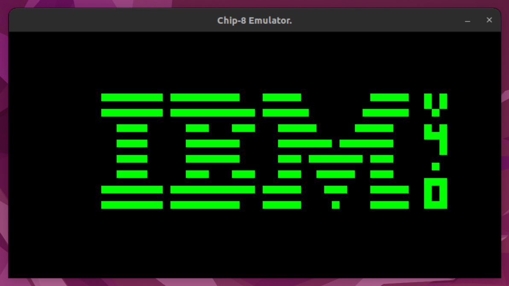

# dm-chip-8-emulator
A simple Chip-8 emulator.

A lot of stuff isnt working yet. only a few instructions working so far.

# Building
Open in vs code and it should configure cmake automaticly on linux.

## Requirments
* SDL2
* cmake

# TODO
* Set up a better build system
* Add more Documentation.
* Add input for exit and keys
